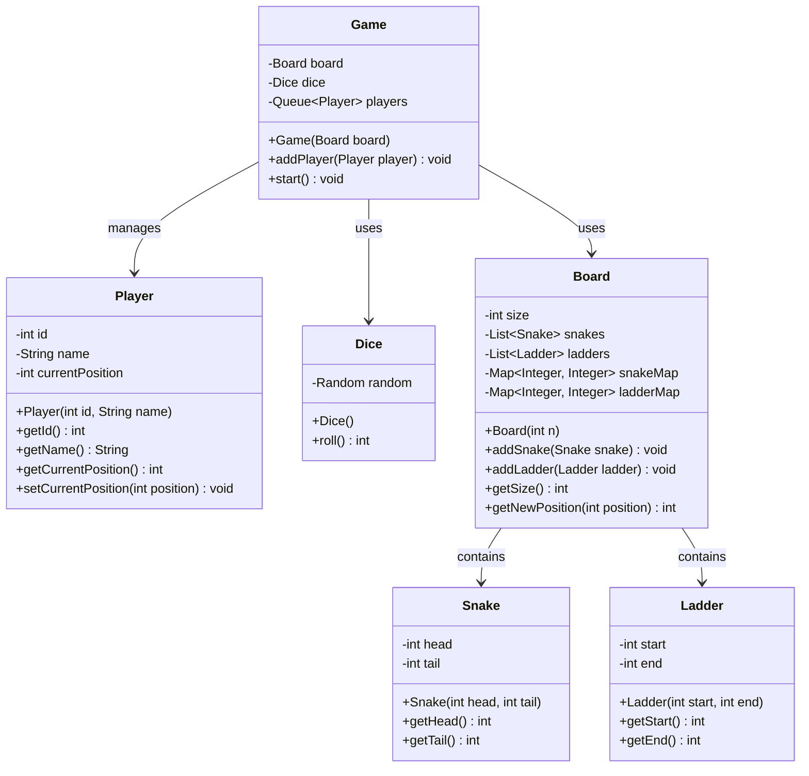

```mermaid
classDiagram
    class Player {
        -int id
        -String name
        -int currentPosition
        +Player(int id, String name)
        +getId() int
        +getName() String
        +getCurrentPosition() int
        +setCurrentPosition(int position) void
    }

    class Snake {
        -int head
        -int tail
        +Snake(int head, int tail)
        +getHead() int
        +getTail() int
    }

    class Ladder {
        -int start
        -int end
        +Ladder(int start, int end)
        +getStart() int
        +getEnd() int
    }

    class Dice {
        -Random random
        +Dice()
        +roll() int
    }

    class Board {
        -int size
        -List~Snake~ snakes
        -List~Ladder~ ladders
        -Map~Integer, Integer~ snakeMap
        -Map~Integer, Integer~ ladderMap
        +Board(int n)
        +addSnake(Snake snake) void
        +addLadder(Ladder ladder) void
        +getSize() int
        +getNewPosition(int position) int
    }

    class Game {
        -Board board
        -Dice dice
        -Queue~Player~ players
        +Game(Board board)
        +addPlayer(Player player) void
        +start() void
    }

    Game --> Board : uses
    Game --> Dice : uses
    Game --> Player : manages
    Board --> Snake : contains
    Board --> Ladder : contains
```
